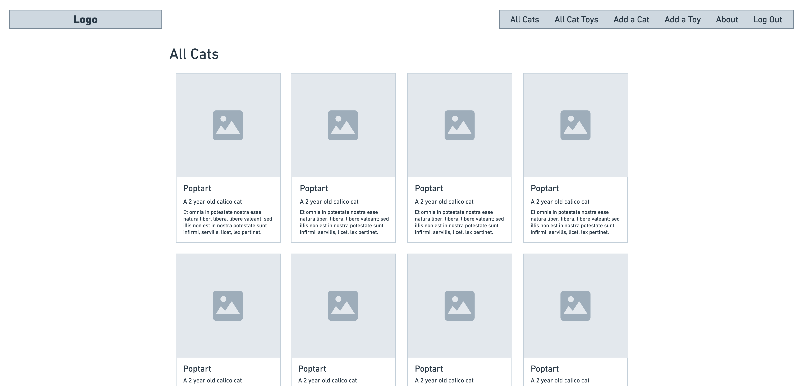

As a User, when I click the All Cats link, I want to see a page listing all of my cats so that I can see them all one one place.

For this User story, we need to build an index page to render a list of all our our cats. To make the UI of this page more appealing , we’ll list our cats using “card” style elements in the UI. Each card will have an image placeholder and some brief details about each cat.

Here is a wireframe of the final design:
